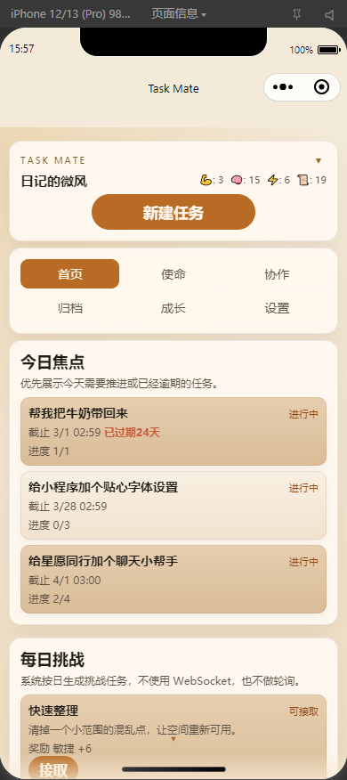
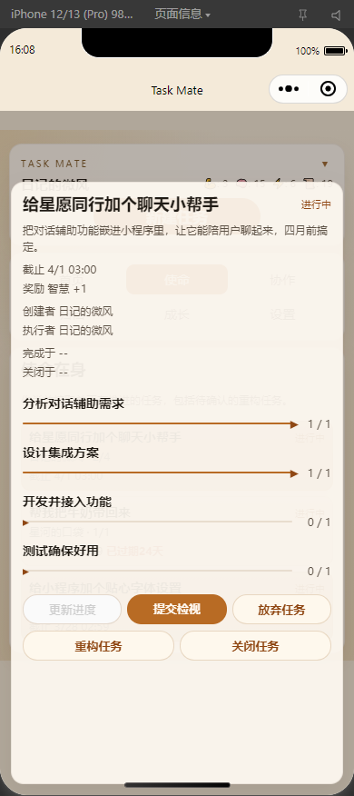
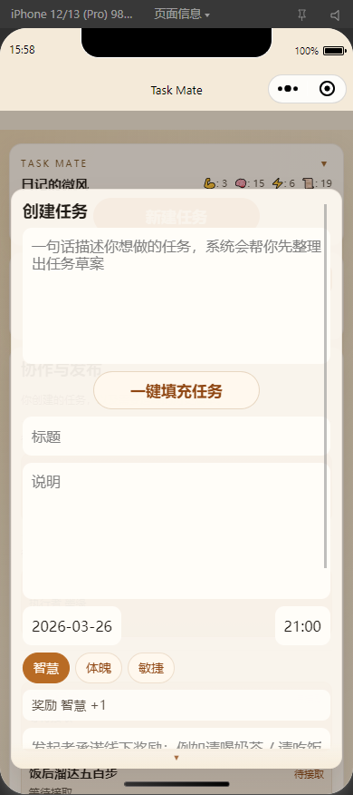
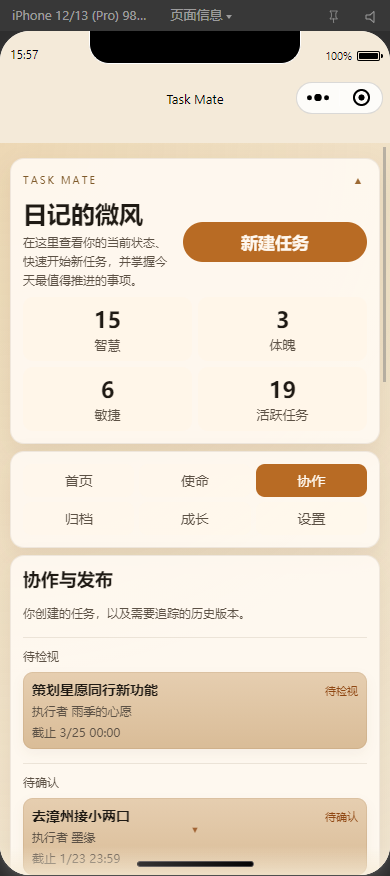
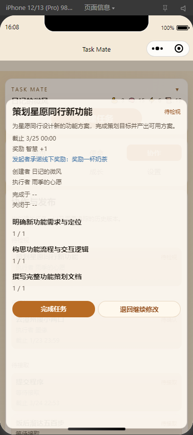
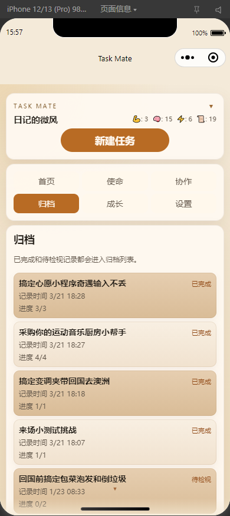
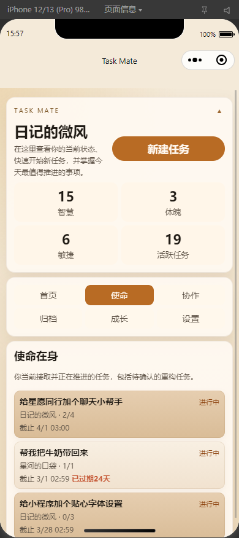

# Task Mate

Task Mate is a WeChat Mini Program for lightweight collaborative task
execution. It combines a compact task workflow with a small progression layer
so that shared tasks feel structured, visible, and rewarding without becoming
heavy project management.

The current repository presents the production-facing CloudBase-native version
of the product.

You can find the Mini Program in WeChat by searching for `星愿同行`.

The current Mini Program experience is Chinese-only.

## Product Positioning

Task Mate is designed for short-cycle collaboration between people who already
communicate inside WeChat and do not want a full project-management suite.

The product sits between:

- personal todo tracking
- lightweight pair or small-team collaboration
- gamified execution and habit systems

Instead of boards, deep navigation, and always-on synchronization, the app
focuses on fast task lifecycle actions:

- create
- share
- accept
- update progress
- review
- rework
- complete
- archive

## What The Product Does

Task Mate focuses on short-cycle collaboration inside the WeChat ecosystem.
Users can create tasks, share them with other people, claim work from shared
links, update subtask progress, submit work for review, return tasks for more
changes, complete tasks, and keep completion history in an archive view.

The app also includes:

- daily challenge tasks
- lightweight attribute rewards
- task rework chains
- archive snapshots
- subscribe-message reminders
- AI-assisted task draft generation
- text moderation for nicknames and task content

## Product Evolution

The original idea started from a broader architecture with a separate frontend,
a standalone backend service, and real-time refresh through WebSocket.

As the product direction became more clearly WeChat-first, the implementation
was narrowed and simplified around the actual target environment:

- native WeChat Mini Program instead of a cross-platform abstraction layer
- Cloud Functions instead of a standalone always-on server
- Cloud Database instead of separately managed backend persistence
- dashboard refresh plus conflict-safe writes instead of persistent socket sync

The result is a version that is cheaper to operate, easier to deploy, and more
aligned with the current product scope.

## Typical User Flow

1. A user opens the Mini Program and gets a profile plus dashboard bootstrap.
2. The user creates either a self-assigned task or a collaborative task.
3. For collaborative work, the creator shares a Mini Program link.
4. Another user opens the link and claims the task if it is still pending.
5. The assignee updates subtask progress from the detail modal.
6. The assignee submits work for review or completes directly when allowed.
7. The creator reviews, sends it back for changes, or finishes the task.
8. Historical results move into archive snapshots for later browsing.

## Technical Summary

- Client: Native WeChat Mini Program
- Backend: CloudBase Cloud Functions
- Database: CloudBase Database
- AI boundary: server-side only
- Sync model: dashboard refresh after mutations plus stale-write protection

Core runtime lives in `cloudbase-native/`.

## Private Setup

The public repository intentionally does not include the real private Mini
Program runtime config.

Required private file:

- `cloudbase-native/miniprogram/config/private.js`
- optional: `cloudbase-native/project.private.config.json`

If that file is missing, cloud initialization and cloud-function calls are
intentionally blocked.

Recommended restore workflow:

1. keep your private package zip outside Git
2. extract it at the repository root
3. confirm `cloudbase-native/miniprogram/config/private.js` exists
4. optionally restore `cloudbase-native/project.private.config.json`
5. continue development and testing normally

After extraction, the project should behave the same way as a normal private
checkout. The existing development workflow, DevTools usage, and testing flow
do not need a separate "secure mode" path.

To rebuild the private package from a configured local checkout:

```bash
cd cloudbase-native
node scripts/build-private-package.js
```

That script creates:

- `cloudbase-native/private-package/task-mate-private-package.zip`

The zip preserves original paths, so extracting it at the repository root
restores the private files directly into place.

## Engineering Focus

This codebase is centered around stateful task collaboration under WeChat
platform constraints rather than generic CRUD scaffolding.

Key implementation concerns include:

- shared-task opening from Mini Program links
- permission-safe claiming and state transitions
- optimistic writes with conflict detection through `updatedAt`
- multi-subtask progress updates without partial data loss
- one-shell UI architecture instead of multi-page task routing
- optional AI integration that does not block the core product
- subscribe-message reminders built around one-shot authorization rules

Detailed engineering notes live in:

1. `cloudbase-native/docs/overview/technical-challenges_en.md`
2. `cloudbase-native/docs/architecture/task-state-machine_en.md`
3. `cloudbase-native/docs/architecture/cloud-functions_en.md`

## Main Capabilities

- bootstrap a user profile automatically
- create normal and self-assigned tasks
- share pending tasks through Mini Program links
- open shared tasks directly from a link
- accept collaborative tasks
- update multiple subtasks in one detail view
- submit review and continue review
- complete, abandon, close, restart, and rework tasks
- browse archive snapshots
- receive subscribe-message reminders for due and overdue work

## Repository Structure

- `cloudbase-native/`
  - current app source, cloud functions, scripts, and project docs

Important subdirectories:

- `cloudbase-native/miniprogram/`
  - native Mini Program client
- `cloudbase-native/cloudfunctions/`
  - task gateway, AI, moderation, and scheduler logic
- `cloudbase-native/docs/`
  - bilingual project documentation
- `cloudbase-native/scripts/`
  - small local helper scripts

## Development And Operation

The current project is developed primarily through WeChat DevTools plus Cloud
Function deployment.

Main working modes:

- frontend UI iteration in `miniprogram/`
- cloud-function logic iteration in `cloudfunctions/`
- environment switching through `scripts/set-cloud-env.js`
- dual-account smoke testing for share, review, and rework flows

Recommended maintainer documents:

1. `cloudbase-native/docs/maintenance/maintainer-guide_en.md`
2. `cloudbase-native/docs/maintenance/development-workflows_en.md`
3. `cloudbase-native/docs/maintenance/operations_en.md`
4. `cloudbase-native/docs/maintenance/integration-checklist_en.md`

## Documentation

Primary project documentation lives under `cloudbase-native/docs/`.

Suggested reading order:

1. `cloudbase-native/README_en.md`
2. `cloudbase-native/docs/README_en.md`
3. `cloudbase-native/docs/overview/system-reference_en.md`
4. `cloudbase-native/docs/overview/tech-stack_en.md`
5. `cloudbase-native/docs/overview/technical-challenges_en.md`

Chinese and English documentation are both available in paired `_cn.md` and
`_en.md` files.

## Screenshots

Home dashboard overview:



Task detail modal with subtasks and state-aware actions:



Create task modal:



Collaboration board and published tasks:



Review or rework state:



Archive tab:



Mission tab and active tasks:



Optional follow-up screenshots worth adding later:

- `assets/screenshots/shared-task-open.png`

## Archive Reference

The older Taro + Express + MongoDB implementation is preserved in the branch
[`archive/legacy-express-taro`](https://github.com/PatrickLin00/task-mate-app/tree/archive/legacy-express-taro).

## Public Repository Notes

- one-off migration artifacts are intentionally excluded
- private deployment files remain ignored by `.gitignore`
- this branch documents only the current CloudBase-native runtime
